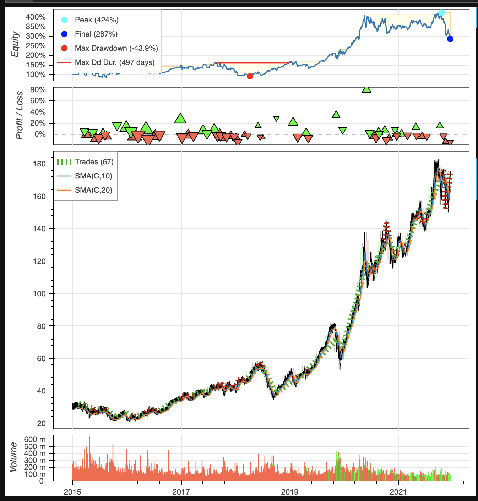

# Trading Strategy Backtesting

This project's aim is to lay the foundation for selecting the optimal ML model or strategy parameters. The model(s) chosen at the end of the notebook can be set as a constant, along with the strategy, allowing for further exploration of feature engineering and hyperparameter tuning.


## Technologies

The project utilizes python 3.9 along with the following packages:

- [pandas](https://pandas.pydata.org/) - Python software library for data manipulation.
- [Pandas Data Reader](https://pandas-datareader.readthedocs.io/en/latest/) - Remote data access for pandas
- [YFinance](https://pypi.org/project/yfinance/) - Open source tool for Yahoo's publicly available API, for education and research purposes
- [Sklearn](https://scikit-learn.org/stable/index.html) - Machine learning tools for predictive data analysis
- [Backtesting](https://kernc.github.io/backtesting.py/doc/backtesting/#gsc.tab=0) - Technical analysis based strategies backtester

Other technologies that were utilized within this project are listed here:

- [DigitalOcean](https://www.digitalocean.com/) - Cloud hosting service that offers simple, lightweight VPS options.
- [Docker](https://docs.docker.com/) - Platform that offers virtual software packages within unique containers. 


## Installation Guide

Clone the repository to your desired location, and confirm that python 3.9 or greater and the packages listed in the Technologies section are installed.

```python
pip install pandas
pip install pandas-datareader
pip install backtesting
pip install -U scikit-learn
pip install yfinance
pip install matplotlib
```

## Getting Started

If you would like to run this remotely, reference [Dockerized-Trading-Research-Droplet](https://github.com/jmischung/Dockerized-Trading-Research-Droplet).

__Model-Based Trading Strategy__
To explore quickly testing different models for a set strategy, run the [backtest\_mbs\_lags.ipynb](https://github.com/jmischung/Trading-Strategy-Backtesting/blob/main/backtest_mbs_lags.ipynb).  In the "Retreive Data and Generate Features" section, specify the start date, end date and ticker you would like to analyze.

At the end of the analysis you will be able to view the cumulative returns, annualized returns, and Sharpe Ratios for the tested models.


__Technical Analysis Based Trading Strategy__
To explore quickly testing a technical analysis strategy and optimzing its parameters, run the [backtest\_ta\_dmac.ipynb](https://github.com/jmischung/Trading-Strategy-Backtesting/blob/main/backtest_ta_dmac.ipynb).  In the "Retreive and Format Data" section, specify the start date, end date and ticker you would like to analyze.

At the end of this analysis, you will be able to view the equity, profit and loss, and volume of the trading strategy.




## Contributors

- Josh Mischung: josh@knoasis.io // [LinkedIn](https://www.linkedin.com/in/joshmischung/)
- Max Acheson: maxacheson@gmail.com // [LinkedIn](https://www.linkedin.com/in/max-acheson-75093a19a/)
- Emily Bertani: emily.bertani.md@gmail.com // [LinkedIn](https://www.linkedin.com/in/emily-bertani-1ab184222/)

## License

MIT License

Copyright (c) [2022] [Joshua Mischung, Max Acheson, Emily Bertani]

Permission is hereby granted, free of charge, to any person obtaining a copy
of this software and associated documentation files (the "Software"), to deal
in the Software without restriction, including without limitation the rights
to use, copy, modify, merge, publish, distribute, sublicense, and/or sell
copies of the Software, and to permit persons to whom the Software is
furnished to do so, subject to the following conditions:

The above copyright notice and this permission notice shall be included in all
copies or substantial portions of the Software.

THE SOFTWARE IS PROVIDED "AS IS", WITHOUT WARRANTY OF ANY KIND, EXPRESS OR
IMPLIED, INCLUDING BUT NOT LIMITED TO THE WARRANTIES OF MERCHANTABILITY,
FITNESS FOR A PARTICULAR PURPOSE AND NONINFRINGEMENT. IN NO EVENT SHALL THE
AUTHORS OR COPYRIGHT HOLDERS BE LIABLE FOR ANY CLAIM, DAMAGES OR OTHER
LIABILITY, WHETHER IN AN ACTION OF CONTRACT, TORT OR OTHERWISE, ARISING FROM,
OUT OF OR IN CONNECTION WITH THE SOFTWARE OR THE USE OR OTHER DEALINGS IN THE
SOFTWARE.
